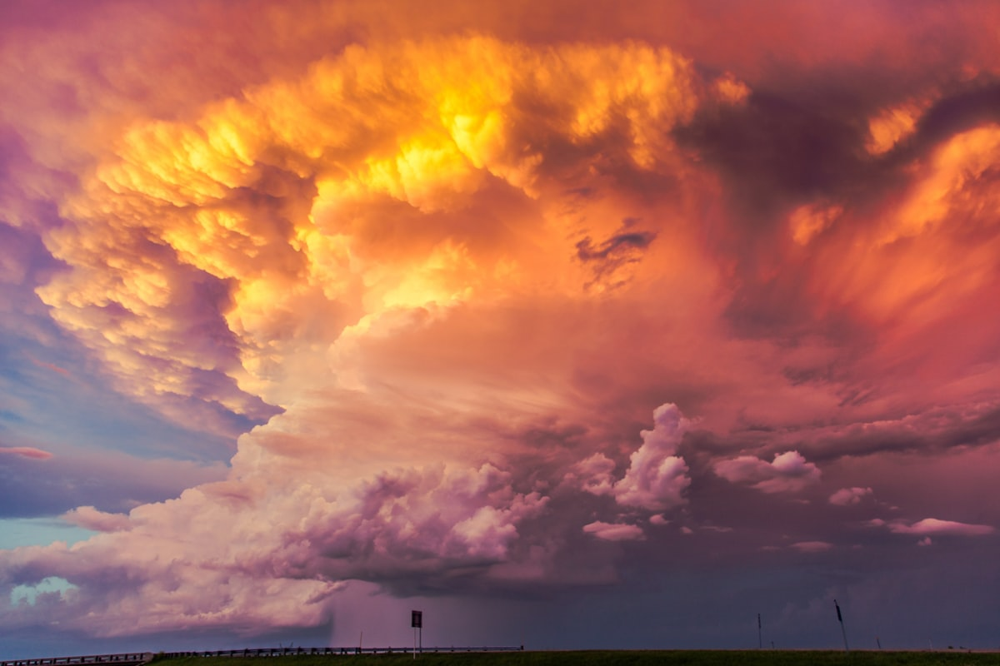

# Weather App



## 🌦️ Overview

Weather App is a modern, responsive web application that provides real-time weather information for locations worldwide. Built with Next.js and powered by the OpenWeatherMap API, this application offers a beautiful, intuitive interface with dynamic backgrounds that change based on current weather conditions.

Designed with user experience in mind, the app features temperature unit toggle, smart city suggestions focusing on SAARC region cities, and a persistent search history to enhance usability.

## ✨ Features

### Core Functionality
- **Real-time Weather Data**: Current conditions including temperature, humidity, wind speed, and pressure
- **Dynamic Backgrounds**: Beautiful backdrop images that change based on current weather
- **Responsive Design**: Optimized for both mobile and desktop devices
- **Error Handling**: Graceful error messages when cities aren't found

### Enhanced User Experience
- **Unit Toggle**: Switch between Celsius (°C) and Fahrenheit (°F)
- **Search Suggestions**: Smart city dropdown with focus on SAARC region cities
- **Search History**: Locally stored history of previous searches
- **Sunrise & Sunset Times**: Daily solar event times for the selected location

## 🚀 Technology Stack

- **Frontend Framework**: Next.js 15 with React 19
- **Styling**: TailwindCSS for responsive, utility-first styling
- **State Management**: React hooks for local state management
- **Data Fetching**: Client-side API integration with fetch
- **Storage**: LocalStorage for persistent search history
- **Weather Data**: OpenWeatherMap API integration

## 🧠 Project Architecture

The application follows a component-based architecture with the following structure:

```
├── app/
│   ├── components/         # UI components
│   │   ├── ErrorDisplay.js  # Error handling component
│   │   ├── SearchBar.js     # Search input with suggestions
│   │   ├── UnitToggle.js    # Temperature unit switcher
│   │   ├── WeatherBackground.js  # Dynamic background handler
│   │   └── WeatherCard.js   # Weather information display
│   ├── utils/              # Utility functions
│   │   ├── cityData.js     # City suggestion data
│   │   ├── searchHistory.js # History management
│   │   └── weatherApi.js   # API interaction
│   ├── layout.js           # App layout wrapper
│   └── page.js             # Main application page
├── public/                 # Static assets
│   └── images/             # Weather background images
└── ...                     # Configuration files
```

## 💻 Getting Started

### Prerequisites

- Node.js 18.x or later
- npm or yarn package manager

### Installation

1. Clone the repository
   ```bash
   git clone https://github.com/yourusername/weather-app.git
   cd weather-app
   ```

2. Install dependencies
   ```bash
   npm install
   # or
   yarn install
   ```

3. Create a `.env` file in the root directory with your OpenWeatherMap API key:
   ```
   NEXT_PUBLIC_WEATHER_API_KEY=your_api_key_here
   NEXT_PUBLIC_WEATHER_API_URL=https://api.openweathermap.org/data/2.5/weather
   NEXT_PUBLIC_WEATHER_API_UNITS=metric
   NEXT_PUBLIC_WEATHER_API_LANG=en
   ```

4. Start the development server
   ```bash
   npm run dev
   # or
   yarn dev
   ```

5. Open [http://localhost:3000](http://localhost:3000) in your browser

## 🌐 Deployment

This app can be deployed to Vercel, Netlify, or any other static site hosting platform:

```bash
# Build for production
npm run build

# Start production server
npm start
```

## 🤝 Contributing

Contributions are welcome! Feel free to open issues or submit pull requests to help improve this project.

1. Fork the repository
2. Create your feature branch (`git checkout -b feature/amazing-feature`)
3. Commit your changes (`git commit -m 'Add some amazing feature'`)
4. Push to the branch (`git push origin feature/amazing-feature`)
5. Open a Pull Request

## 📄 License

This project is licensed under the MIT License - see the LICENSE file for details.

## 👏 Acknowledgements

- Weather data provided by [OpenWeatherMap API](https://openweathermap.org/api)
- Background images from [Unsplash](https://unsplash.com/)
- Icons and design inspiration from various open-source projects

---

© 2025 Weather App | Developed by Aditya Singha
